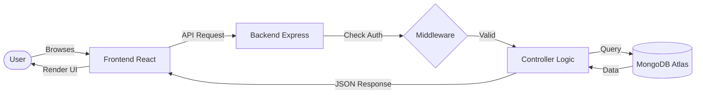

# StayNest 🏠

A modern property rental platform (Airbnb-style) built with **React**, **Node.js**, **Express**, and **MongoDB**. Users can list properties, book their stays, and leave reviews.

## 📂 Overall File Structure

```text
StayNest/
├── backend/             # Node.js codebase (Port 3000)
│   ├── config/          # DB & Storage configs
│   ├── controllers/     # Core Business Logic
│   ├── models/          # Data Schemas (User, Listing, Booking, Review)
│   ├── routes/          # API Endpoints
│   └── middleware/      # Auth & Security checks
├── frontend/            # React codebase (Port 5173/5174)
│   ├── src/
│   │   ├── api/         # Axios central instances
│   │   ├── components/  # Reusable UI Blocks (listing, booking, auth)
│   │   ├── pages/       # Different page views
│   │   └── assets/      # Styles & Global assets
├── README.md            # Master project guide
```

## 🔄 Working Flow (High-Level)



## 🚀 Quick Setup

To run the full project locally, you need to open two terminals:

### 1. Start the Backend
```bash
cd backend
npm install
# Ensure you have a .env file with ATLAS_DB and SECRET
npm run dev
```

### 2. Start the Frontend
```bash
cd frontend
npm install
npm run dev
```

## 🛠 Key Features

- **Auth:** Complete Signup/Login flow using Passport-local.
- **Listings:** Create, Edit, and Delete property listings with image upload.
- **Maps:** Location pinning via OpenStreetMap & Nominatim geocoding.
- **Bookings:** Check-in/Check-out date system with live price calculation.
- **Reviews:** Rating and comment system for each property.
- **Search:** Category-based filters and location/title search.

---
*Feel free to explore the individual READMEs in the `frontend/` and `backend/` folders for more details on project structure and technology.*
